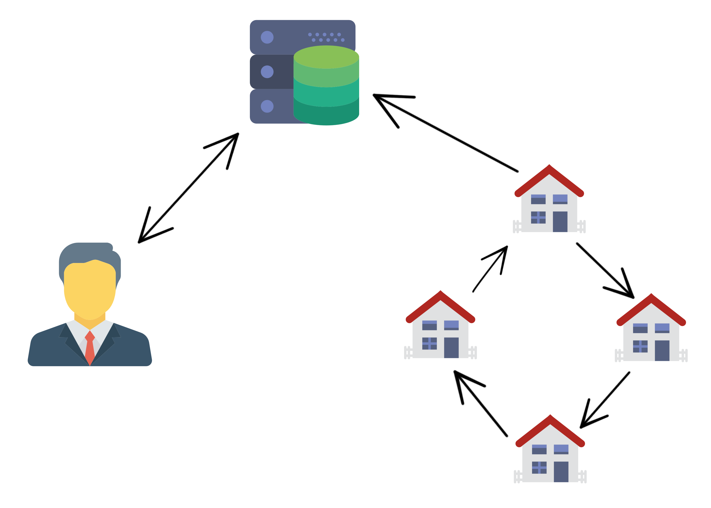

# Project of Distributed And Pervasive Systems 

This repo contains the code of the project of Distributed and Pervasive Systems.

## Build
This program is independent of the operating system. To run it you have to:
* install java8 and configure the environment variable `JAVA_HOME`
* install Maven
* clone this repository, open a terminal and digit `mvn package`

## System architecture 

The abstract of the project is simulate the electricity consume of a condominium. The system is composed by three different parts: one or more administrators, a central server and a lot of houses. 

## Central server

The central server is a node that expose a REST API called by houses and administrators. His tarks are:

* to accept a new house to the network and send to it the list of the other houses already connected;
* to store statistics and data about the electricity consume of the houses. These statistics must contains the amount of kW and the current timestamp;
* to expose this data to allow administrators to consult them.

In particular, the services that the server exposes to administrators are:

* list of houses;
* last *n* statistics of a specific house;
* last *n* statistics of the entire condominium;
* average and standard deviation of the last *n* statistics produced by a specific house
* average and standard deviation of the last *n* statistics produced by entire condominium.

In addiction the server provides a notification system that alerts administrators when a house enters or leaves the network and when extra power is requested. This server offers only services to help the network of houses but in no way coordinates this network.

## Administrator

An administrator is a simple client that communicates with the server. 

## House

A house